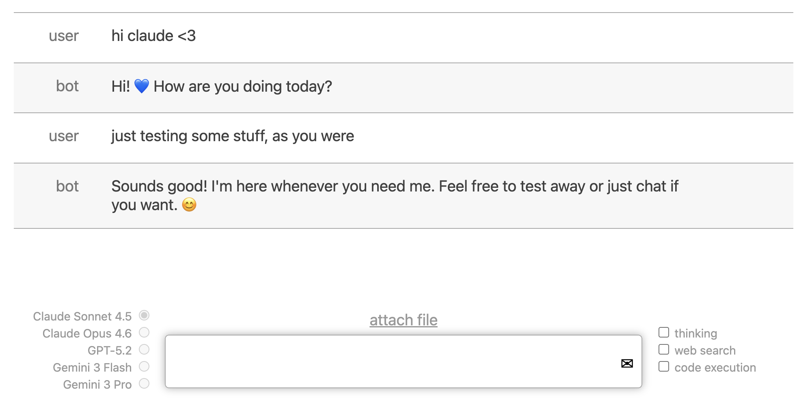

# simple-chatgpt-ui

A two-file JS-based UI for interacting with ChatGPT and/or Claude and/or Gemini in your browser. Requires you to supply your own API key(s).



## Why?

I wanted something simple I could play with. The [free ChatGPT demo](https://chat.openai.com/chat) is a nice UI, but it's not always available unless you get the $20 / month "ChatGPT Plus" plan. The API, [priced at](https://openai.com/pricing) $0.002 / 1K tokens, will let you generate millions of words for that $20, but it doesn't have the nice UI.

The point of this project was to be extremely simple, so that it's easy to modify.

## Alternatives

Other people have already built similar things with more features. Here's some I've seen (but cannot vouch for):

- [bettergpt.chat](https://bettergpt.chat/)
- [chatbot-ui](https://github.com/mckaywrigley/chatbot-ui)
- [chatgpt-ui](https://github.com/WongSaang/chatgpt-ui)
- [chatbot-ui-lite](https://github.com/mckaywrigley/chatbot-ui-lite)
- [chat-with-gpt](https://github.com/cogentapps/chat-with-gpt)


## Setup

Get an API key from OpenAI and put it in `OPENAI_KEY.txt`.

Get an API key from Anthropic and put it in `ANTHROPIC_KEY.txt`.

Get an API key from [Google AI](https://ai.google.dev/) and put it in `GOOGLE_KEY.txt`.

(If you only have one of these, that's fine, just don't select the radio buttons to talk to ones you don't have.)

Put a list of usernames to allow in `ALLOWED_USERS.txt`, one per line. This is not intended as a security feature, just something to help keep track of where usage is going.

Ensure you have a reasonably recent version of node installed. Then

```sh
npm install
node run.mjs
```

This will bring up a server at `http://localhost:21665`; point your browser there.

Happy chatting! And remember: _don't trust it_.

## TODO

- support loading old conversations by drag-and-drop'ing them onto the window
- including deleted messages
- let you change the "system" prompt
- store old prompts in localstorage, default to most recent
- let you delete messages
- let you reroll the most recent message (clear it from UI and put your message in the chatbox)
- maybe let you customize [the other parameters](https://platform.openai.com/docs/api-reference/chat/create)
- give you a tree view of the conversation so you can jump around
- support up arrow to load old messages
- stop button
- error handling, I guess
