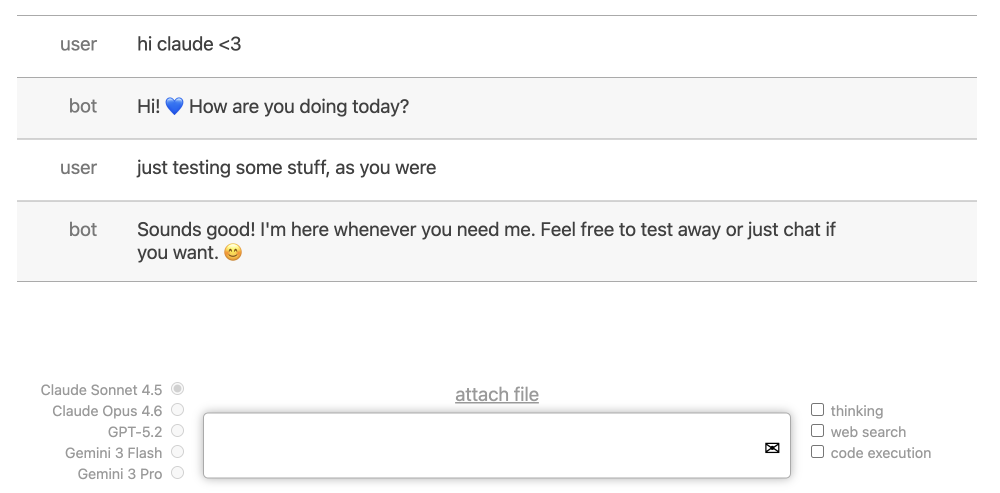

# simple-chatgpt-ui

A JS-based UI for interacting with ChatGPT and/or Claude and/or Gemini and/or other models in your browser. Requires you to supply your own API key(s).



## Alternatives

Other people have built similar things with more features which you should probably use instead, unless you're specifically looking for something simple to mess with.

I've most commonly seen [Open WebUI](https://github.com/open-webui/open-webui) recommended.

## Setup

Get an API key from OpenAI and put it in `OPENAI_KEY.txt`.

Get an API key from Anthropic and put it in `ANTHROPIC_KEY.txt`.

Get an API key from [Google AI](https://ai.google.dev/) and put it in `GOOGLE_KEY.txt`.

(If you only have one of these, that's fine, just don't select the radio buttons to talk to ones you don't have.)

Put a list of usernames to allow in `ALLOWED_USERS.txt`, one per line. This is not intended as a security feature, just something to help keep track of where usage is going.

Ensure you have a reasonably recent version of node installed. Then

```sh
npm install
node run.ts
```

This will bring up a server at `http://localhost:21665`; point your browser there.

Happy chatting! And remember: _don't trust it_.

## Previous version

This was rewritten from ~scratch by Claude in Feb 2026. Old code is still around as the `old` branch if you need that for some reason.